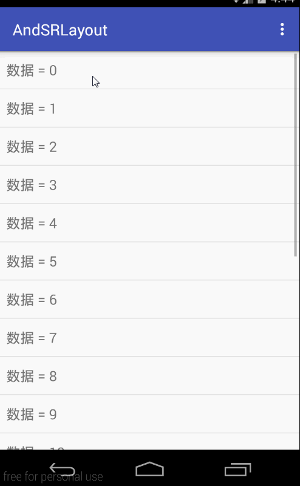

#### Android-PullRefreshLayout
基于SwipeRefreshLayout下拉刷新、上拉加载。支持所有的AbsListView、RecycleView

####特点
 * 在 layout 中使用，支持 AbsListView 所有的xml属性
 * 支持自动下拉刷新，什么用呢？比如进入界面时，只需要调用 autoRefresh() 方法即可，同时下拉刷新回调函数将会被调用。
 * 上拉加载支持自定义 View 或设置加载文字、动画
 * 轻松设置 Adapter 空数据视图，默认为 TextView 支持更文字，也可自定义 View
 * 对于简单的界面，如只有 ListView 可以继承 [app](pullrefreshlayout/src/main/java/com/mylhyl/prlayout/app)
   包中 Fragment 轻松搞定

####效果图


####使用
  仔细看 listSelector 属性，效果见 sample
```xml
<com.mylhyl.prlayout.SwipeRefreshListView xmlns:android="http://schemas.android.com/apk/res/android"
    xmlns:tools="http://schemas.android.com/tools"
    android:id="@+id/swipeRefresh"
    android:layout_width="match_parent"
    android:layout_height="match_parent"
    android:listSelector="@drawable/selector_list"
    tools:context=".app.ListViewXmlFragment" />
```
 设置上拉加载，更多方法见 [IFooterLayout](pullrefreshlayout/src/main/java/com/mylhyl/prlayout/internal/IFooterLayout.java)
```java
        IFooterLayout footerLayout = swipeRefreshListView.getFooterLayout();
        footerLayout.setFooterText("set自定义加载");
        footerLayout.setIndeterminateDrawable(getResources().getDrawable(R.drawable.footer_progressbar));
```
 自定义上拉加载
 
 * 方式一：注意此方法必须在 setOnListLoadListener 之前调用
 
```java
        getSwipeRefreshLayout().setFooterResource(R.layout.swipe_refresh_footer);        
        
```
 * 方式二：继承重写 getFooterResource() 方法
 
```java
        public class MySwipeRefreshGridView extends SwipeRefreshGridView {
            public MySwipeRefreshGridView(Context context) {
                super(context);
            }
        
            public MySwipeRefreshGridView(Context context, AttributeSet attrs) {
                super(context, attrs);
            }
        
            @Override
            protected int getFooterResource() {
                return R.layout.swipe_refresh_footer;
            }
        }
```
设置adapter空数据视图文字
```java
        swipeRefreshListView.setEmptyText("数据呢？");
```
 自定义adapter空数据视图
```java
        ImageView emptyView = new ImageView(getContext());
        emptyView.setImageResource(R.mipmap.empty);
        swipeRefreshGridView.setEmptyView(emptyView);
```

####使用Gradle构建时添加一下依赖即可:
```javascript
compile 'com.mylhyl:pullrefreshlayout:1.1.0'
```
#### 如果使用eclipse[可以点击这里下载jar包](preview/pullrefreshlayout.jar)
#### [下载APK体验](preview/sample-debug.apk)

QQ交流群:435173211
